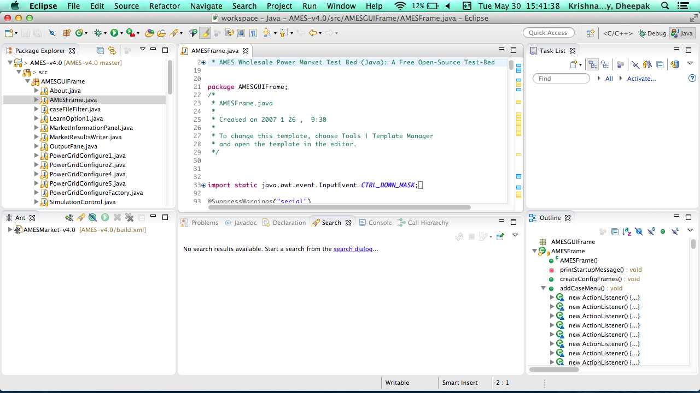
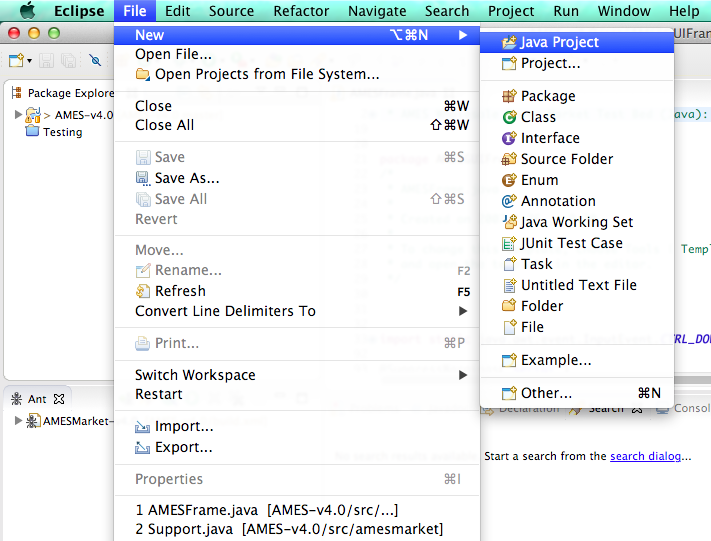
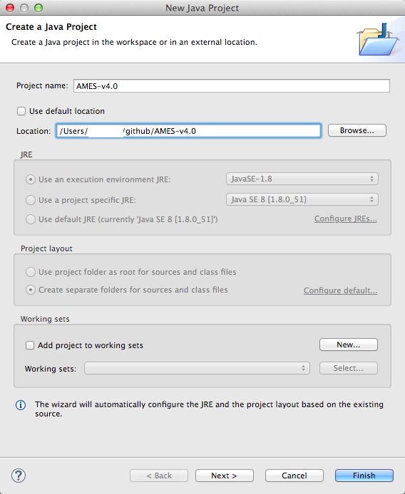
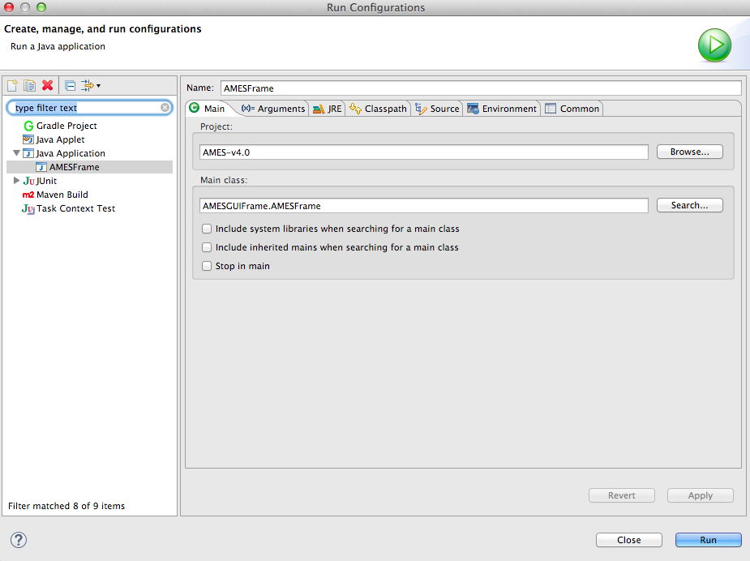
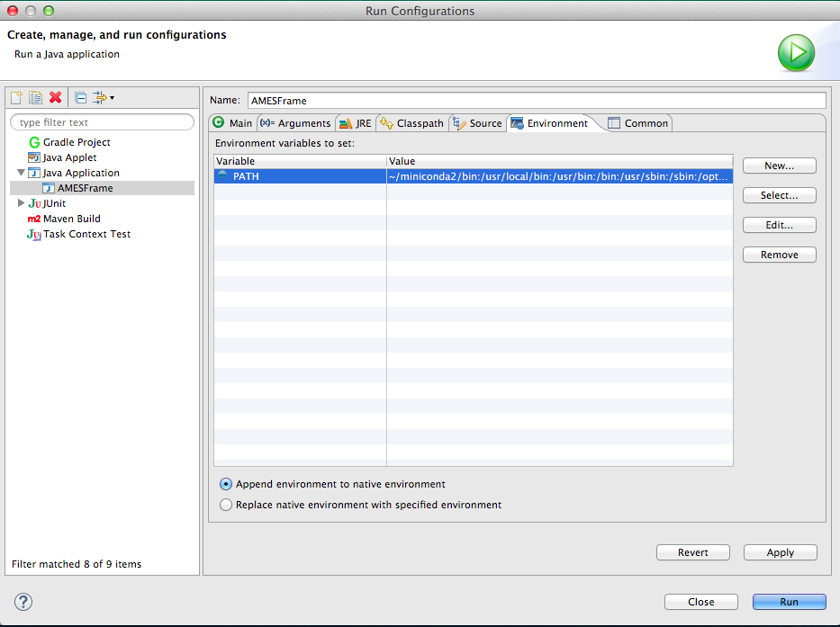
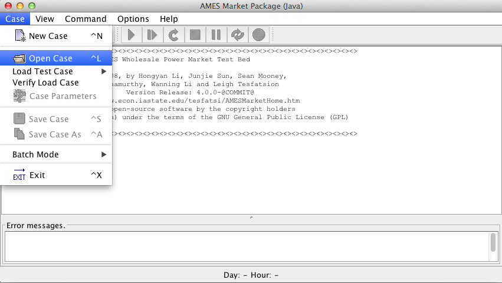
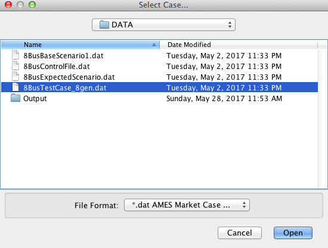
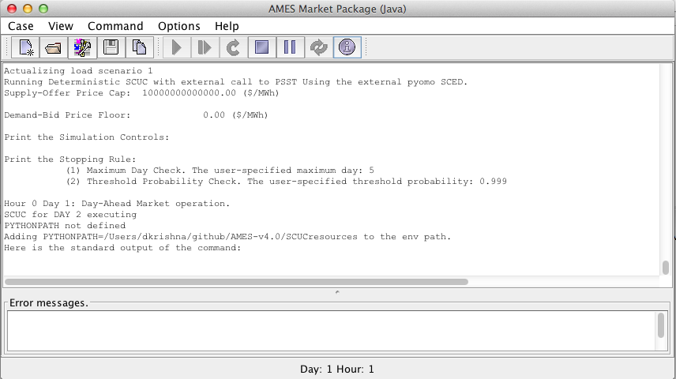
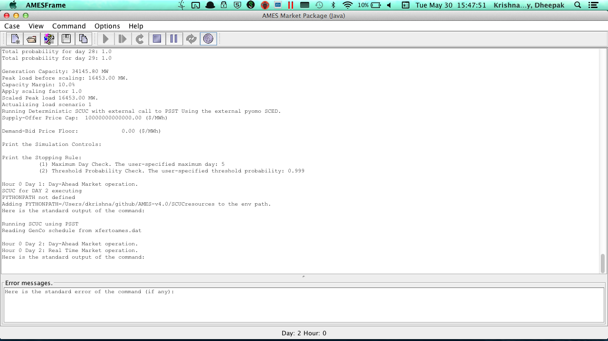
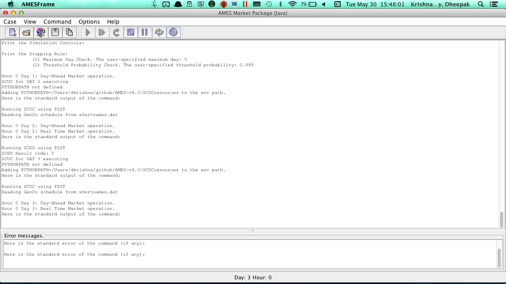

# Install Instructions for AMES (V4.0)

## Requirements

AMES (V4.0) is a Java/Python based software.

### Install Java

Java can be downloaded from here [https://java.com/en/download/](https://java.com/en/download/).

### Install Python

**Option 1 : Using Anaconda (RECOMMENDED)**

_Note: if you have previously installed Anaconda use `conda update anaconda` from the command line_

1. Download the latest version of Anaconda2 x64 from Continuum <https://www.continuum.io/downloads>. You don't have to enter any contact information if you don't want to.
    * Windows
        * Click on Anaconda2-4.0.0-Windows-x86_64.exe and follow instructions

    * OSX
        * Click on Anaconda2-4.0.0-MacOSX-x86_64.dmg and follow instructions

2. Verify that conda has been installed
    * `conda --version` should result in `conda 4.0.X`
    * Windows : pip --version should result in something like `pip 8.1.X from C:\Anaconda2\lib\site-packages (python 2.7)`
    * OSX : `pip --version` should result in something like `pip 8.1.X from /Users/$USER/anaconda/lib/python2.7/site-packages (python 2.7)`


Do not proceed if you do not see `anaconda` in the path when you type `pip --version`. If you do not see anaconda, reinstall anaconda and check if the installation was successful. If you still do not see anaconda in the path, check your `$PATH` variable to see if the directory to anaconda exists.

**Option 2 : Using (System) Python (Advanced*)**

1. Download the latest version of Python2 from here <https://www.python.org/downloads/> i.e. Python 2.7.11
2. Follow instructions to install
3. Note that this is standard Python, and does not come with binaries for matplotlib, numpy, scipy, pandas etc. If you know how to install these then go ahead. Check advanced instructions for more information

### Install git (Optional but recommended)

To download the AMES (V4.0) source code, you can either use the download button on Github or you can use git to download AMES (V4.0). Using git allows easier updates to AMES (V4.0)

Download [git](https://git-scm.com/) and run through the install instructions by clicking yes for all the options by default. Windows users will install `git bash` in addition to `git` which is an alternative shell.

#### Download AMES (V4.0) using git

Open `git bash` and type the following

```bash
cd C:                                                      # Change directory to C Drive
mkdir gitrepos                                             # Make a folder (directory) called "gitrepos"
cd gitrepos                                                # Change directory to gitrepos
git clone https://github.com/kdheepak/AMES-v4.0
cd AMES-v4.0
```

These instructions are only required the first time you download AMES (V4.0). For further updates, you can use the following instructions.

#### Update AMES (V4.0) using git

```bash
cd C:
cd gitrepos/AMES-v4.0
git fetch
git reset --hard origin/master                             # This will delete any local changes you make inside the AMES-v4.0 folder, please contact the developer if you have any questions
```

Use the above instructions if there are any new features or bugfixes


### Install psst

```bash
cd C:
cd gitrepos/AMES-v4.0/psst
pip install -e .
```

### Install CPLEX or CBC

CPLEX can be downloaded from [https://www-01.ibm.com/software/commerce/optimization/cplex-optimizer/](https://www-01.ibm.com/software/commerce/optimization/cplex-optimizer/)

Optionally, you can install (CBC)[https://www.coin-or.org/download.html] as the solver. CBC is free and open source.

### Install Eclipse (Optional but recommended)

The recommended way to install or develop AMES (v4.0) is Eclipse. Other options are using Netbeans or the `ant` but these may not be officially supported in the future.

* Download [Eclipse Installer](https://www.eclipse.org/downloads/) and run the installer
* Select "Eclipse IDE for Java Developers" and click install

### Running AMES



- Load the AMES (V4.0) project in Eclipse as a new Java project and select the source files as "C:\gitrepos\AMES-v4.0"


- The project and main class will be as follows

- Configure the "PATH" variable in Eclipse to match your system "PATH" variable in "Run Configuration".
    - This step is important since Eclipse should find Python, psst and the solver of your choice
    - On Windows, you can type `path` in a CMD prompt and take the necessary paths from there and paste them into this value
    - On Linux, OSX, you can type `echo $PATH` in a terminal and take the necessary paths from there and paste them into this value

- Compiling and running AMES requires clicking the "Run" button in Eclipse. Once AMES starts, load the 8 bus test case.


- Click the play button





